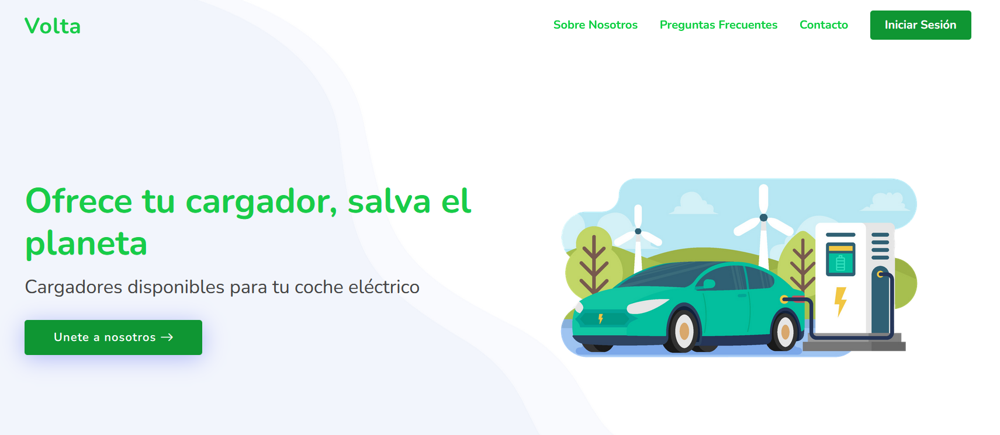

# Web Application Development Course Projects

This repository contains all the practical work completed for the Web Application Development course at Universidad Pontificia Comillas ICAI.

## Projects Overview
### 1. Practica-1-Pagina-Web-Base - Introduction to hosting websites on GitHub Pages.

- This was a brief refresher on how to build websites from the ground up using HTML and CSS. 
- The objective was to build a site template inspired by a specific company and host it using GitHub pages with a very basic skeleton layout which we would build upon later. 

### 2. Practica-2-Bootstrap - Exploration of Bootstrap framework and template usage.

- This was the project which followed, going through Bootstrap and it's efficient CSS development and 12 column structure. 
- I built upon the website in project 1 by obtaining a bootstrap template and evolving the appearance of the website, by reading documentation and applying good structure and design changes. 

### 3. Practica-3-API-Management - Fundamentals of API management.

- This class reviewed the usage of API's and how to navigate their documentation. For the class project we had to develop a website (this time incorporating JavaScript) which had two API's interact with each other. 
- The project you can observe is a mix between where the International Space Station is located in real time with its API, and using a weather API combining these you can figure out not only where the ISS is, but what the weather is like over that region. 
- I started off with a rough skeleton website, and then incorporated a smooth and nice design with bootstrap to improve the user experience and layout. 

### 4. Practica-4-Springboot - API development using Spring Boot.

- For this practical we dive a lot deeper onto the CRUD methodologies for an API, and how we can develop them using a Java Back-end in the form of SpringBoot. 
- Personally, I think that SpringBoot is super bloated as a back-end, but it was good to learn about another possible tech stack and building upon my OOP classes from the previous year. 
- The API developed was very simple, we developed it just so that a user could fill in a personal details form to sign up to our website, and be able to get the information through a GET method without validation parameters in the same screen. 

### 5. Practica-5-Springboot-Testing - Backend function testing in Spring Boot applications.
- This was an evolution from our previous project, adding validation to our form now. Ensuring that the dates of birth, email and names had a valid format using RegEx validation. This was an example of implementing unit tests. 
- As this data would then be registered into a database we learned the importance of backend testing so that data would be uniform across the board. 

### 6. Practica-Final - Final Project

- We had around a week to develop our final project along with a classmate. We had an idea for developing an electric car charger rental service named Volta. Where users would be able to use or rent out their electric car chargers in exchange for a fee. Gig economy style.
- The site is able to register users and charger hosts, it's also able to add chargers to the database so that users can book a slot for them. They are also visible using a map functionality. This was all possible by recompiling everything we learned in the course. Using Bootstrap templates, JavaScript scripts, a SpringBoot back-end and our own API to allow the front-end to communicate with the back-end. 

## Getting Started

Each folder has its own README in Spanish if you're curious to go in more detail into each project. 

## Prerequisites

List of any software, tools, or dependencies required to run these projects.

## Installation

Just be sure you're able to run SpringBoot and have Java, Maven, etc... installed for Practicals 4 onwards | [Link to Springboot installation](https://spring.io/guides/gs/spring-boot). The rest are all standard webfiles. 

## Contributing

As this is coursework, contributions are not expected. However, feedback and suggestions are welcome.